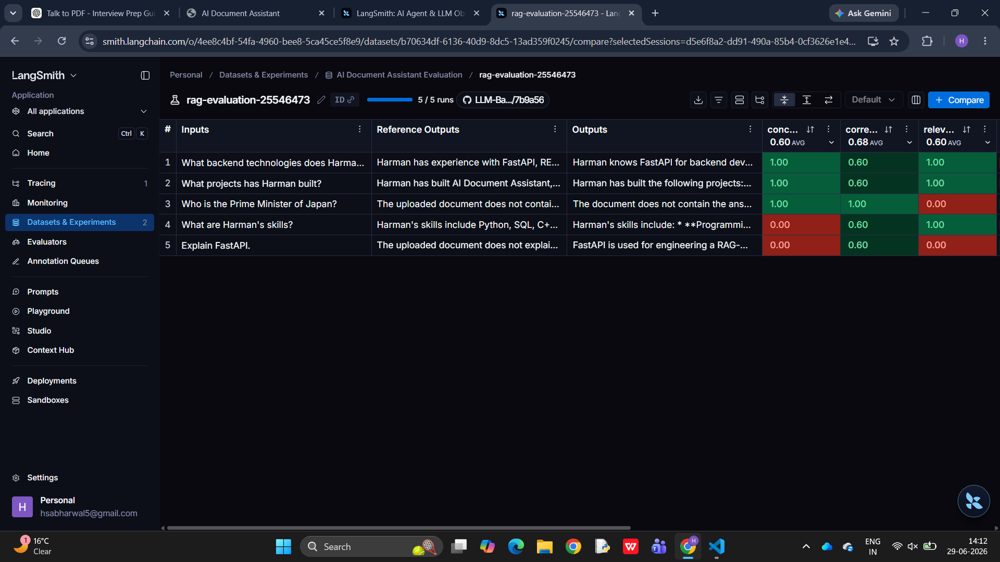

# AI Document Assistant

An AI-powered document question-answering system that uses Retrieval-Augmented Generation (RAG) to provide grounded responses from uploaded PDF documents. The application features a FastAPI backend, a lightweight frontend, semantic retrieval using FAISS, Dynamic Top-K retrieval, CrossEncoder reranking, and real-time streaming responses.

---

# Features

* Upload PDF documents
* Semantic search using vector embeddings
* Dynamic Top-K retrieval based on similarity threshold
* CrossEncoder reranking for improved retrieval quality
* Context-grounded answer generation using Gemini 2.5 Flash
* Real-time streaming responses
* Conversation history support
* Markdown response rendering
* Source page citations
* Reset conversation functionality

---

# System Architecture

```text
User
  │
  ▼
Frontend (HTML/CSS/JavaScript)
  │
  ▼
FastAPI Backend
  │
  ▼
PDF Loader
  │
  ▼
Recursive Text Chunking
  │
  ▼
Sentence Transformer Embeddings
  │
  ▼
FAISS Vector Store
  │
  ▼
Top-10 Semantic Retrieval
  │
  ▼
Dynamic Top-K Filtering
  │
  ▼
CrossEncoder Reranking
  │
  ▼
Gemini 2.5 Flash
  │
  ▼
Streaming Response
```

---

# How It Works

### 1. Document Processing

* Upload a PDF document.
* Extract text from the PDF.
* Split the document into overlapping chunks.
* Convert each chunk into embeddings using Sentence Transformers.
* Store the embeddings inside a FAISS vector database.

---

### 2. Query Processing

When a user asks a question:

1. The frontend sends the query to the FastAPI backend.
2. The query is converted into an embedding.
3. FAISS retrieves the Top-10 most similar chunks using L2 distance.
4. Dynamic Top-K filters chunks using an empirically tuned similarity threshold.
5. If fewer than two chunks satisfy the threshold, the system falls back to the two best retrieved chunks.
6. A CrossEncoder reranks the retrieved chunks based on query-document relevance.
7. The highest-ranked chunks are passed to Gemini 2.5 Flash.
8. Gemini generates a grounded answer using only the retrieved context.
9. The response is streamed back to the frontend in real time.

---

# Tech Stack

### Backend

* Python
* FastAPI
* LangChain

### Frontend

* HTML
* CSS
* JavaScript

### Retrieval

* Sentence Transformers
* FAISS
* Recursive Character Text Splitter
* Dynamic Top-K Retrieval
* CrossEncoder Reranking

### LLM

* Gemini 2.5 Flash

---

# Retrieval Improvements

## Dynamic Top-K

Instead of always passing a fixed number of chunks to the language model, the system:

* Retrieves the Top-10 candidate chunks.
* Filters chunks using an empirically tuned L2 distance threshold.
* Guarantees at least two retrieved chunks.
* Dynamically adjusts the number of chunks supplied to the LLM.

This reduces irrelevant context while preserving important information.

---

## CrossEncoder Reranking

Retrieved chunks are reranked using a CrossEncoder model.

Unlike embedding similarity, the CrossEncoder jointly evaluates the user query and each retrieved chunk, producing a more accurate relevance score before passing the final context to the LLM.

---

# Guardrails

The application includes lightweight input guardrails to mitigate prompt injection attacks before the retrieval pipeline is executed.

Current guardrails detect common prompt injection patterns such as attempts to:

* Ignore previous instructions
* Reveal system prompts
* Override document context
* Perform jailbreak-style requests

Queries matching these patterns are rejected before retrieval, ensuring the assistant remains focused on the uploaded document.

---

# RAG Evaluation

The retrieval pipeline was evaluated using **LangSmith** with a manually curated benchmark dataset consisting of document-grounded question-answer pairs.

The application uses **Gemini 2.5 Flash** for answer generation, while **Groq (Llama 3.3 70B)** is used as an independent LLM judge for automated evaluation.

### Evaluation Setup

| Component            | Implementation                            |
| -------------------- | ----------------------------------------- |
| Answer Generation    | Gemini 2.5 Flash                          |
| Retrieval            | FAISS + Dynamic Top-K                     |
| Reranking            | CrossEncoder (MS MARCO MiniLM)            |
| Evaluation Framework | LangSmith                                 |
| LLM Judge            | Groq (Llama 3.3 70B)                      |
| Evaluation Metrics   | Correctness, Relevance, Concision         |
| Benchmark Dataset    | 5 document-grounded question-answer pairs |

### Evaluation Dashboard



### Evaluation Summary

| Metric      | Average Score | Description                                                                           |
| ----------- | :-----------: | ------------------------------------------------------------------------------------- |
| Correctness |    **0.68**   | LLM-judged factual correctness compared with reference answers.                       |
| Relevance   |    **0.60**   | Measures whether the generated response directly addresses the user's query.          |
| Concision   |    **0.60**   | Measures whether generated responses remain concise relative to the reference answer. |

### Observations

* Dynamic Top-K successfully reduced irrelevant context supplied to the language model.
* CrossEncoder reranking improved the ordering of retrieved chunks before answer generation.
* The system consistently rejected questions unrelated to the uploaded document.
* Evaluation highlighted edge cases where a concept was mentioned in the document but not explicitly explained, demonstrating the trade-off between strict grounding and providing helpful summaries.


# Current Features

* PDF Upload
* Semantic Search
* Dynamic Top-K Retrieval
* CrossEncoder Reranking
* Prompt Injection Guardrails
* Grounded Answer Generation
* Streaming Responses
* Conversation History
* Markdown Rendering
* Source Citations
* LangSmith Evaluation Pipeline

---

# Future Improvements

* Hybrid Search (BM25 + Dense Retrieval)
* Multi-document Retrieval
* Output Guardrails
* Hybrid Retrieval Evaluation (RAGAS / DeepEval)
* Model Gateway (Gemini / Groq)
* Agentic Routing with Web Search Fallback
* Deployment


---

# What I Learned

Through this project I gained practical experience with:

* Retrieval-Augmented Generation (RAG)
* FastAPI backend development
* Semantic search using vector databases
* Sentence Transformer embeddings
* FAISS indexing
* Dynamic retrieval strategies
* CrossEncoder reranking
* Prompt engineering
* Streaming LLM responses
* Frontend-backend integration
* Building end-to-end AI applications

---

# Project Status

The project currently implements a production-inspired RAG pipeline with semantic retrieval, Dynamic Top-K filtering, reranking, streaming responses, and grounded answer generation. Additional work is planned to improve robustness through hybrid retrieval, evaluation, guardrails, and intelligent routing.
